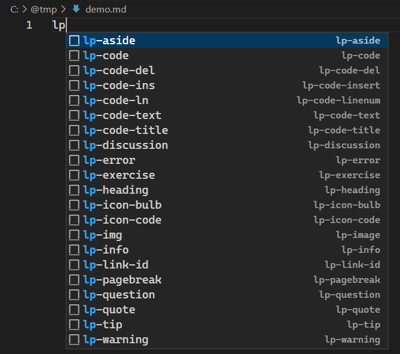
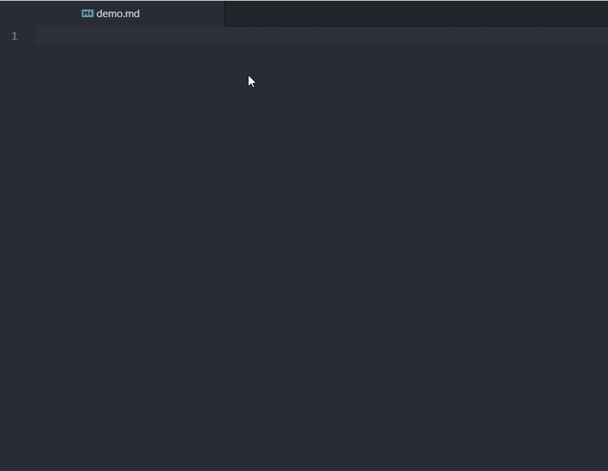

# Snippets-for-Leanpub

Code snippets for writing Leanpub e-books.

## Installation for Visual Studio Code

1. Click File | Preferences | Configure User Snippets, then select Markdown or markdown.json from the dropdown list.
2. Now you should see markdown.json in current editor window. Copy all text from [vscode/markdown.json](vscode/markdown.json) and paste to the editor window, then save the file.

Since Quick Suggestions feature for Markdown is disabled by default, so we need to enable it. Press Ctrl+Shift+P, then select "Preferences: Open User Settings (JSON)" to open settings.json file. Paste the following text:

```
{
    // Configure settings to be overridden for the markdown language.
    "[markdown]":  {
        "editor.quickSuggestions": {
            "other": true,
            "comments": true,
            "strings": true
        }
    }
}
```

Now when you type "lp" in a markdown file, you should see Quick Suggestion list shown as below.



## Installation for Atom

I didn't bother to create an Atom package, so simply a copy-and-paste will do the trick:

1. Open your snippets file from Atom editor. You can do this by clicking "File > Snippets..." from main menu.
2. Copy text from Atom/snippets.cson and paste it to your snippets.cson, save it. Done.



Note that you may need to install [Markdown Grammer](https://atom.io/packages/language-markdown) package.

Here are some more Atom packages you might be interested:

 * [Markdown Preview Plus](https://atom.io/packages/markdown-preview-plus)
 * [markdown-scroll-sync](https://atom.io/packages/markdown-scroll-sync)
 * [markdown-table-editor](https://atom.io/packages/markdown-table-editor)
 * [Markdown-Writer for Atom](https://atom.io/packages/markdown-writer)
 * [Sublime Style Column Selection](https://atom.io/packages/Sublime-Style-Column-Selection)
